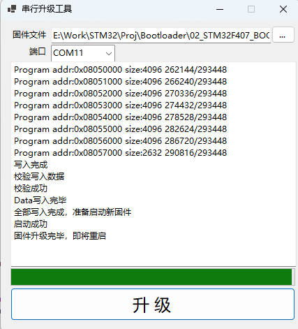
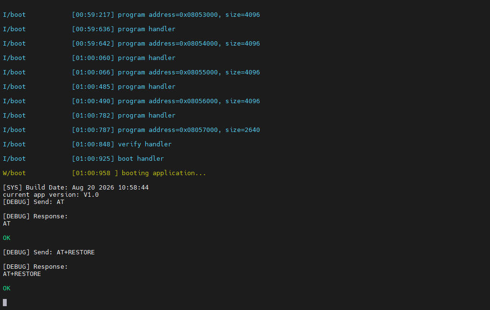

# STM32F407 Bootloader

基于 STM32F407ZGTx（Cortex-M4）的串口 IAP Bootloader 工程，使用 Keil MDK（uVision5）+ ST 标准外设库（SPL）开发。Bootloader 通过自定义串口协议接收上位机指令，完成 Flash 擦除、写入、校验和跳转，实现应用固件的串口在线升级。





## 功能特性

- 支持串口在线升级（IAP）：查询版本/MTU、擦除、编程、CRC32 校验、复位、跳转应用
- 自定义协议帧：帧头 + 操作码 + 长度 + 载荷 + CRC16，逐字节状态机解析，字节间超时 20ms
- 三重升级入口判断：Magic Header 校验失败、按键、串口数据（3 秒窗口）
- 应用校验：Magic Header（0x0800C000）+ 应用区 CRC32，校验失败自动停留 Bootloader
- Bootloader 区保护：禁止擦除/写入 Bootloader 自身区域
- 中断接收 + 环形缓冲区（5KB），可承受最大 4KB+ 的单包载荷
- 基于 TIM6 的精确延时/时钟，EasyLogger 分级彩色日志输出

## 硬件平台

| 项目 | 说明 |
| --- | --- |
| MCU | STM32F407ZGTx，Cortex-M4，1MB Flash，192KB RAM |
| 外部晶振 | 12MHz |
| 升级串口（USART3） | TX: PC10，RX: PC11，115200 8-N-1，中断接收 |
| 日志串口（USART1） | TX: PA9，RX: PA10，115200（EasyLogger 输出） |
| 按键 | KEY1: PE4（低电平有效），KEY2: PE3（低电平有效，用于进入升级模式） |
| LED | LED1: PF9，LED2: PF10 |

## Flash 内存布局

| 地址范围 | 用途 |
| --- | --- |
| 0x08000000 ~ 0x0800BFFF | Bootloader 区（48KB，受写保护） |
| 0x0800C000 | Magic Header（固件描述信息，CRC32 保护） |
| 0x08010000 ~ 0x080FFFFF | 应用区（起始地址 0x08010000） |

应用固件必须链接在 `0x08010000` 起始地址，并在启动时设置 `SCB->VTOR = 0x08010000`。Bootloader 跳转前会先关闭 TIM6、USART1、USART3 中断并复位外设。

## 目录结构

```text
├── app/                 # 应用层
│   ├── main.c           # 入口：板级初始化、日志初始化、Bootloader 主流程
│   ├── bootloader.c     # Bootloader 核心：启动流程、协议解析与命令处理
│   ├── board.c/.h       # 板级外设定义（按键、LED、时钟使能）
│   ├── magic_header.c/.h# Magic Header 读写与校验
│   ├── jumpapp.s        # 跳转汇编（加载 MSP 和 PC）
│   └── utils.h          # 常用宏
├── driver/              # 板级驱动
│   ├── bl_usart/        # 升级串口 USART3（中断接收）
│   ├── console/         # 日志串口 USART1（重定向 printf/fputc）
│   ├── stm32flash/      # 片内 Flash 擦除/编程封装
│   ├── tim_delay/       # TIM6 延时与毫秒时钟
│   ├── key/             # 按键驱动
│   └── led/             # LED 驱动
├── firmware/            # ST 标准外设库（CMSIS + SPL）
├── third_lib/           # 第三方库
│   ├── crc/             # CRC16 / CRC32
│   ├── easylogger/      # EasyLogger 日志
│   └── ringbuffer/      # 环形缓冲区
├── mdk/                 # Keil MDK 工程（stm32f407.uvprojx）
└── assets/              # 素材（日志打印、上位机截图）
```

## 构建

1. 安装 Keil MDK（uVision5）及 STM32F4xx 器件包。
2. 打开 `mdk/stm32f407.uvprojx`。
3. 编译（F7），产物输出至 `mdk/Objects/stm32f407.bin`。
4. 首次烧录使用 J-Link/ST-Link 直接写入 `0x08000000`，之后即可通过串口升级应用。

## 使用说明（升级流程）

设备上电后进入 3 秒“升级判定窗口”，满足以下任一条件则停留在 Bootloader 等待升级：

1. Magic Header 无效或应用 CRC32 校验失败（自动停留）；
2. 3 秒内按下 KEY2（PE3）；
3. 3 秒内 USART3 收到任意数据。

否则自动校验应用并跳转运行。

停留 Bootloader 后（LED1 常亮），通过上位机（参见 `assets/` 截图）连接 USART3（115200），典型升级流程：

1. 查询版本与 MTU（`0x01`），确认通信正常；
2. 擦除应用区（`0x81`，地址 + 长度）；
3. 分块写入固件（`0x82`，每包载荷 ≤ 4096 字节，需 4 字节对齐）；
4. CRC32 校验写入内容（`0x83`）；
5. 发送复位（`0x21`）或跳转应用（`0x22`）。

> 升级过程中任何时刻按 KEY2 可复位系统。

## 串口协议

### 请求帧（主机 → Bootloader）

| 字段 | 长度 | 说明 |
| --- | --- | --- |
| 帧头 | 1 | 0xAA |
| 操作码 | 1 | 见下表 |
| 载荷长度 | 2 | 小端，最大 4104 |
| 载荷 | n | 长度由上一字段决定 |
| CRC16 | 2 | 对前面所有字节的 CRC16 校验 |

### 响应帧（Bootloader → 主机）

| 字段 | 长度 | 说明 |
| --- | --- | --- |
| 帧头 | 1 | 0x55 |
| 操作码 | 1 | 回显请求操作码 |
| 错误码 | 1 | 见下表 |
| 载荷长度 | 2 | 小端 |
| 载荷 | n | 查询结果等数据 |
| CRC16 | 2 | 对前面所有字节的 CRC16 校验 |

### 操作码

| 操作码 | 命令 | 载荷格式 | 说明 |
| --- | --- | --- | --- |
| 0x01 | INQUERY | subcode(1) | subcode 0x00 返回版本字符串；0x01 返回 MTU（u16） |
| 0x81 | ERASE | addr(4) + size(4) | 擦除目标地址范围内涉及的扇区 |
| 0x82 | PROGRAM | addr(4) + size(4) + data(size) | 按字（4 字节）编程，需 4 字节对齐 |
| 0x83 | VERIFY | addr(4) + size(4) + crc32(4) | 计算 Flash 区 CRC32 并与预期值比较 |
| 0x21 | RESET | 无 | 应答后软件复位 |
| 0x22 | BOOT | 无 | 应答后校验应用并跳转 |

### 错误码

| 错误码 | 含义 |
| --- | --- |
| 0x00 | OK |
| 0x01 | 操作码错误 |
| 0x02 | 缓冲区溢出 |
| 0x03 | 超时 |
| 0x04 | 帧格式错误 |
| 0x05 | 校验失败 |
| 0x06 | 参数错误（地址越界、长度不匹配、Bootloader 区保护） |
| 0xFF | 未知错误 |

## Magic Header

固定存放在 `0x0800C000`，用于描述待运行的应用固件：

| 字段 | 说明 |
| --- | --- |
| magic | 魔数 "MAGI"（0x4D414749） |
| bitmask | 位掩码，标识有效字段 |
| data_type | 数据类型（APP = 0） |
| data_offset | 固件文件相对 Magic Header 的偏移 |
| data_address | 固件实际写入地址 |
| data_length | 固件长度 |
| data_crc32 | 固件内容 CRC32 |
| version[128] | 固件版本字符串 |
| this_crc32 | 结构体自身 CRC32（从结构体首部到该字段） |

`magic_header_validate()` 校验魔数与结构体 CRC32；启动前还会对应用区按 `data_address/data_length` 计算 CRC32 并与 `data_crc32` 比对。

## 注意事项

- `stm32_flash_program()` 按 4 字节字编程，写入地址与长度需 4 字节对齐；
- 擦除为扇区粒度（16KB/64KB/128KB），会擦除与目标范围相交的所有扇区；
- Bootloader 区（0x08000000 ~ 0x0800BFFF，48KB）在固件层禁止擦除与写入；
- 应用固件需自行设置 `SCB->VTOR = 0x08010000` 并使用对应的分散加载文件；
- 升级串口与日志串口相互独立，调试时可用 USART1 观察 Bootloader 日志。
